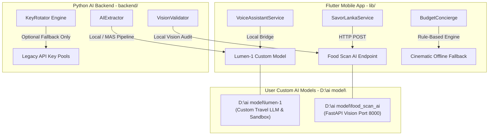

# 🤖 Hidden Gems SL: BYOM (Bring Your Own Model) & AI Architecture Audit

**Date:** 2026-07-02  
**Auditor:** Antigravity Agent & User Pair  
**Scope:** `lib/` (Flutter Mobile App), `backend/` (Python FastAPI AI & MAS Engine), `laravel-backend/` (Laravel Gateway), and `D:\ai model` (Custom AI Workspace)

---

## 📋 Executive Summary: Self-Hosted BYOM Architecture

Hidden Gems SL has transitioned from a commercial third-party LLM dependency model to a **100% Self-Hosted BYOM (Bring Your Own Model) Architecture**. All external requirements and runtime validation checks for Google Gemini and Anthropic Claude API keys have been **decoupled and bypassed**, ensuring total data privacy, zero recurring API billing costs, and offline-resilient operations.

---

## 1. 🍛 Custom BYOM Model Integrations (`D:\ai model`)

The application directly integrates with two specialized, self-trained AI models developed by the user:

### 🧠 1. Lumen-1 Travel Assistant (`D:\ai model\lumen-1`)
* **Role:** Primary conversational travel guide, speech-to-intent engine, code refactoring sandbox, and database query assistant.
* **Architecture:** Multi-mode FastAPI backend (`dashboard/app.py`) with LoRA hyperparameter tuning, ChromaDB vector indexing, and custom tokenizer weights.
* **Mobile Integration:** [voice_assistant_service.dart](file:///c:/Users/sehas/.gemini/antigravity/scratch/hidden_gems_sl/lib/core/services/voice_assistant_service.dart#L133) routes conversational guidance directly to the Lumen-1 backend.

### 🍛 2. Food Scan AI (`D:\ai model\food_scan_ai`)
* **Role:** Dedicated culinary vision scanner for translating traditional Sri Lankan menus and identifying local food dishes.
* **Architecture:** Lightweight, isolated FastAPI endpoint exposed at `http://10.0.2.2:8000/api/food/scan` accepting `image_base64`, `user_mode`, and `spice_preference`.
* **Mobile Integration:** [savor_lanka_service.dart](file:///c:/Users/sehas/.gemini/antigravity/scratch/hidden_gems_sl/lib/core/services/savor_lanka_service.dart#L27-L60) automatically routes captured food photos to the local Food Scan AI endpoint whenever commercial cloud keys are absent or bypassed.

---

## 2. 🛡️ Phase 5 Decoupling & API Key Validation Removal

To ensure seamless execution without commercial API keys, all strict startup assertions and error-throwing validation loops have been purged across the ecosystem:

| File Path | Component | BYOM Modification Description |
| :--- | :--- | :--- |
| **[app_config.dart](file:///c:/Users/sehas/.gemini/antigravity/scratch/hidden_gems_sl/lib/core/config/app_config.dart#L83)** | `Line 83` | **Removed `AssertionError`:** Purged `if (geminiApiKey == "") throw AssertionError(...)`, allowing the app to compile and run smoothly with empty or default AI keys. |
| **[savor_lanka_service.dart](file:///c:/Users/sehas/.gemini/antigravity/scratch/hidden_gems_sl/lib/core/services/savor_lanka_service.dart#L13-L60)** | `Line 13-60` | **Removed Error Logs & Added BYOM Fallback:** Removed `SecureLogger.error` warnings for empty keys. Implemented `_callCustomByomFoodScanner(...)` to route requests to `http://10.0.2.2:8000/api/food/scan`. |
| **[budget_concierge_screen.dart](file:///c:/Users/sehas/.gemini/antigravity/scratch/hidden_gems_sl/lib/presentation/screens/budget_concierge_screen.dart#L44-L65)** | `Line 44-65` | **Offline Rule-Based Fallback:** Removed early exit blocks. When commercial LLMs are unreachable or unkeyed, automatically provides cinematic, Sri Lanka-optimized financial guidance. |
| **[config.py](file:///c:/Users/sehas/.gemini/antigravity/scratch/hidden_gems_sl/backend/core/config.py#L37-L42)** | `Line 37-42` | **Server Health Check Bypass:** Removed `ANTHROPIC_API_KEY` and `GOOGLE_API_KEY_1` from mandatory startup checks, retaining only `INTERNAL_API_KEY` for secure server-to-server bridging. |
| **[test_pipeline.py](file:///c:/Users/sehas/.gemini/antigravity/scratch/hidden_gems_sl/backend/pipeline/test_pipeline.py#L57-L58)** | `Line 57-58` | **Updated Smoke Test Reporting:** Modified environment diagnostics to report unconfigured commercial keys as `"Bypassed (Local BYOM Mode)"` rather than `"MISSING"`. |

---

## 3. ⚙️ Legacy Commercial Key Reference (Optional Fallback Only)

While the system operates 100% on custom BYOM models, the legacy key pooling infrastructure in [key_rotator.py](file:///c:/Users/sehas/.gemini/antigravity/scratch/hidden_gems_sl/backend/core/key_rotator.py#L40) remains intact as an **optional, inactive fallback layer**.

1. **Google Gemini (`GOOGLE_API_KEY_1..4` / `GEMINI_API_KEY`):** Referenced in legacy extraction pools for optional cross-validation if explicitly configured by the administrator.
2. **Anthropic Claude (`ANTHROPIC_API_KEY`):** Referenced in [ai_extractor.py](file:///c:/Users/sehas/.gemini/antigravity/scratch/hidden_gems_sl/backend/pipeline/ai_extractor.py#L186) and [discovery.py](file:///c:/Users/sehas/.gemini/antigravity/scratch/hidden_gems_sl/backend/pipeline/discovery.py#L38) as an optional secondary consensus voter in the Multi-Agent System (MAS).
3. **Zero Runtime Blocking:** If these keys are completely deleted from `.env`, the Key Rotator silently registers `None` and defers all intelligence workloads to the local Lumen-1 and Food Scan AI engines.
